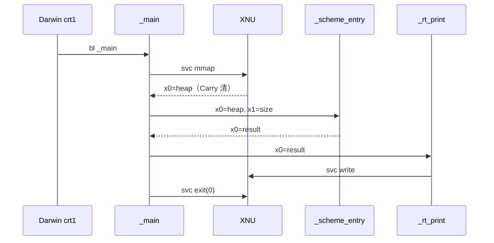

# Apple M3 Pro / Darwin arm64 CPU 与汇编操作手册

面向正在实现本教程的人：早期层的目标代码是**手写** Darwin/arm64 `.s`。L00 的 `_scheme_entry` 检入在 [`compiler/scheme_entry.s`](../compiler/scheme_entry.s)；runtime 是 [`runtime/aarch64-apple/runtime.s`](../runtime/aarch64-apple/runtime.s)。胶水只有 `Makefile` 与 shell。仓库**禁止** Python、C，以及用 Chez / Guile / 其它脚本语言 emit 汇编。自托管阈值之后，编译器才用本教程的 Scheme 子集写；`emit_*` 是那份合同，不是现在去开一个 Python 生成器。默认机器是 **Apple M3 Pro，AArch64，macOS Darwin/XNU**。

叙述用简体中文；助记符、寄存器名、路径、符号保持英文。

本手册不是 ARM Architecture Reference Manual 的缩写本。只覆盖本项目做到闭包与 syscall 为止会碰到的指令、寄存器和陷阱。芯片无关的标签、IR、自托管后的 `emit_*` 合同仍以 [ARCHITECTURE.md](../ARCHITECTURE.md) 为准；层间锁死的细节以 [layers/_contract.md](../layers/_contract.md) 为准。本文只把那些合同**落到这颗 CPU 上**。

## 目录

1. [这颗 CPU 是什么](#1-这颗-cpu-是什么)
2. [执行模型](#2-执行模型)
3. [寄存器全景](#3-寄存器全景)
4. [栈](#4-栈)
5. [内存与寻址](#5-内存与寻址)
6. [本教程会用到的指令速查](#6-本教程会用到的指令速查)
7. [调用约定（对本项目）](#7-调用约定对本项目)
8. [和 Scheme 运行时怎么接](#8-和-scheme-运行时怎么接)
9. [调试直觉](#9-调试直觉)
10. [对照表（若你熟悉 x86-64）](#10-对照表若你熟悉-x86-64)

**先读哪些仓库文件**

| 文件 | 本文用它钉死什么 |
|------|------------------|
| `compiler/scheme_entry.s` | L00 手写的 `_scheme_entry`（返回未打标签的 42；只保存 `x29`/`x30`） |
| `runtime/aarch64-apple/runtime.s` | `_main`、`mmap`/`write`/`exit`、`svc #0x80`、Darwin syscall 寄存器 |
| `layers/_contract.md` | HP / SELF / argc / MV 等层间锁；禁止 Python / C |
| `ARCHITECTURE.md` §4–§5、§7 | 抽象寄存器 ↔ 物理寄存器；runtime 边界 |
| `backend/README.md` | Apple ARM64 ABI 与 Linux 的差异 |

```
compiler/scheme_entry.s   （手写 _scheme_entry）
runtime/aarch64-apple/runtime.s  （_main / mmap / _rt_print / svc）
        ↓
clang 只汇编、只链接 .s  →  ./program
```

---

## 范围之外（写死）

本教程 / 本手册**不覆盖**：

- **NEON / SIMD**（`v`/`q` 寄存器）。L53 选择 bignum，不用浮点传参。
- **SVE**。
- **PAC / BTI 的细节**。M3 上 Pointer Authentication **存在**；手写 `stp x29, x30` + `ret` 对本教程足够。不要在 `_scheme_entry` 里发 `pacibsp` / `retab`，也不要为此去学 EL1。
- **AArch32 / Thumb**。这里是 64-bit only。
- **异常级、中断、MMU 编程**。你在用户态，OS 已经把页表设好。
- **在 `_scheme_entry`（及以后的 Scheme 过程代码）里 `svc`**。syscall 只属于 `runtime/*.s`。

---

## 1. 这颗 CPU 是什么

Apple M3 Pro 是 **Apple Silicon**：ARMv8-A 家族上的 **AArch64** 实现（Apple 自己的核，不是「买一颗 Cortex-A」）。对本教程，你只需要把它当成：

1. **只跑 64 位。** 没有「切换到 AArch32」。指令 32 位宽，数据通路 64 位。
2. **小端（little-endian）。** 一个 64 位 Scheme 字存进内存时，最低字节在最低地址。标签在**最低几位**，所以 `ldr` 出一个字之后可以直接 `and x9, x0, #7`。
3. **Load/store 体系。** 算术只发生在寄存器里。要从堆读 `car`，必须 `ldr`；要写 `cdr`，必须 `str`。没有 x86 那种 `add [mem], imm`。
4. **用户态进程。** 你的 `.s` 被 `clang` 汇编进 Mach-O，Darwin 的 XNU 用页表把 `mmap` 来的堆交给你。你碰不到裸设备。

「arm64」是 Apple 对 AArch64 的产品名；`uname -m` 打印 `arm64`。文档、三重名、`clang -arch arm64` 都用这个词。和 Linux 发行版说的 `aarch64` 是同一套指令集，**ABI 和 syscall 不是同一套**（见 §3、§6、§7）。

指令必须 4 字节对齐。所以 L00 写 `.p2align 2`（2 次幂 = 4 字节）。跳进未 4 字节对齐的地址（含 `PC+2`）会立刻炸。

---

## 2. 执行模型

CPU 对每条指令大致做三件事（流水线比这细得多，实现者不需要管）：

```
  ┌────────┐    ┌────────┐    ┌─────────┐
  │ fetch  │ →  │ decode │ →  │ execute │
  │ 取指   │    │ 译码   │    │ 执行    │
  └────────┘    └────────┘    └─────────┘
       ↑                         │
       │    下一条 PC            │ 普通指令：PC += 4
       └─────────────────────────┘ 跳转：PC ← 目标
```

**PC（program counter）** 指向当前指令。AArch64 里你很少直接写 PC；`adr` 会把「某标签的地址」算进通用寄存器，`b` / `bl` / `ret` 会改 PC。

顺序执行时 PC 每次 +4。本教程会改 PC 的指令：

| 指令 | 何时出现 |
|------|----------|
| `b` | `if` 的汇合、自身尾调用（L31） |
| `b.cond` / `cbz` / `cbnz` | 条件跳；**假值不要用 `cbz`**（见 §6） |
| `bl` | 调 `_scheme_entry`、`_rt_print`、`_rt_error` |
| `blr` | Scheme → Scheme 普通调用（L24） |
| `br` | 跨过程尾调用（L32） |
| `ret` | 函数返回，等价于 `br x30` |
| `svc` | 只在 runtime 里陷入内核 |

### 条件标志 NZCV

许多指令（尤其 `cmp`）写入 **NZCV**：

| 标志 | 含义 | Scheme 为什么在乎 |
|------|------|-------------------|
| **N**egative | 结果最高位为 1 | 有符号 `fx<` 走 `lt`，不走无符号 `lo` |
| **Z**ero | 结果为 0 | `eq` / `ne`；`fixnum?` 的 `(x & 3) == 0` |
| **C**arry | 无符号进位 / **Darwin syscall 失败** | `runtime.s` 用 `b.cs` 判断 `mmap` 失败；**不是** Linux 的负 errno |
| **oV**erflow | 有符号溢出 | 本教程 L53 之前不做溢出检测；比较用 `lt`/`gt` 即可 |

`cmp Xn, Xm` 计算 `Xn - Xm`，丢掉差值，只留标志。随后 `b.eq` / `csel …, eq` 读这些标志。

**和 Scheme 编译器的关系（就这几条）：**

- 每个表达式的值是一个 64 位**已标签字**，通常在 `x0`。类型在低位，不是在 NZCV 里。
- `if` 的假值是满字等于 `#f`（`0x2F`），**不是**「寄存器为 0」。fixnum `0` 的编码就是 `0`，却是真。
- 有符号比较必须用 `lt`/`le`/`gt`/`ge`。`-1` 的标签是 `0xFFFFFFFFFFFFFFFC`，当无符号数它比 `0` 还大。
- Darwin syscall 用 **Carry** 报错。`compiler/scheme_entry.s` 不 `svc`，但你读 `runtime.s`、用 lldb 单步时会看见 `b.cs`。

---

## 3. 寄存器全景

31 个 64 位通用寄存器 `X0`–`X30`，加上 `SP`。每个 `Xn` 的低 32 位叫 `Wn`。还有一个**零寄存器** `XZR` / `WZR`：读出来是 0，写进去丢掉。

`SP` 和 `XZR` 编码上挤在同一个槽：多数数据指令里那个编码是 `XZR`，栈操作里是 `SP`。所以你写 `mov x0, sp` 合法，`add sp, sp, x0` 合法，但不要指望「第三操作数的 sp」在任意指令里都表示栈指针。

### 3.1 `Xn` 与 `Wn`

```
Xn:  [63 ──────────────────────── 0]
Wn:                    [31 ────── 0]
```

写 `Wn` 会把 `Xn` 的高 32 位置 0。L00 手写的是 `mov x0, #42`；若误写成 `mov w0, #42`，对这个小正数碰巧结果相同。**L12 起堆指针是 64 位，禁止用 `w19` 做 bump。** 加载字节用 `ldrb w3, [x2]`（`runtime.s` 的 `_rt_error` 量字符串长度）是对的：你要的就是 8 位，高位清零。

### 3.2 特殊角色

| 寄存器 | 角色 | 本项目 |
|--------|------|--------|
| `x29` | FP（帧指针） | Apple：只要有帧，就维护 `x29` 链。L00 已 `stp x29, x30` + `mov x29, sp` |
| `x30` | LR（返回地址） | `bl`/`blr` 写入；`ret` 读出。自己 `bl` 之后，旧 LR 必须已在栈上 |
| `sp` | 栈指针 | 任何**即将 `bl` 的时刻** 16 字节对齐 |
| `xzr` | 零 | `str xzr, [x0]` 可清一个字；不要拿它当通用临时 |

### 3.3 Apple ARM64 ABI（不是 Linux AAPCS 脚注）

整数参数 / 返回值与 AAPCS64 **相同**的部分：

- 参数：`x0`–`x7`，再多的走栈。
- 返回值：`x0`（本项目没有 128 位返回）。
- callee-saved：`x19`–`x28`，以及 `x29`。
- `x30` 是 LR：被调用方若还要 `bl`，必须保存。

**caller-saved（volatile，调用后作废）：** `x0`–`x17`。其中：

| 寄存器 | Apple / Darwin | 不要做 |
|------|----------------|--------|
| `x0`–`x7` | 参数 / 返回 | Scheme 值也走这里 |
| `x8` | ABI 里是**间接结果**寄存器（大结构体返回时，调用方把隐藏指针放这里） | 本项目无 C。L24 起 **Scheme 内部**用 `x8` 传 **未打标签的 `argc`**。`bl _rt_error` 时不要指望 `x8` 仍是 argc |
| `x9`–`x15` | 临时 | ARCHITECTURE 指定给 emit 内部用 |
| `x16` / `x17` | 动态链接 trampoline（IP0/IP1） | **不要当长期临时**。runtime 里 `x16` **只**装 syscall 号 |
| `x18` | **平台保留，系统用** | **禁止占用。** Linux aarch64 一般可用；Darwin 不行 |

**callee-saved：** 你弄脏了就必须在 `ret` 前恢复，否则调用方（`_main`、将来的 runtime 辅助）会坏。

本项目**无 C 源文件**，但 `_scheme_entry` 对 `_main` 仍是「Darwin 整数约定下的普通函数」。保存规则完全按这张表，不是「我们自己发明一套」。

### 3.4 本教程锁死的寄存器

与 [ARCHITECTURE.md](../ARCHITECTURE.md) §5、[layers/_contract.md](../layers/_contract.md) 一致。后面层**覆盖**合同里尚未收窄的选项时，以该层文档为准（L35 对 `x22` 即是如此）。

| 抽象名 | 物理 | 从哪层开始必须遵守 | 保存类 |
|--------|------|-------------------|--------|
| `RES` / `ARG0` | `x0` | L00 | caller-saved |
| `ARG1`…`ARG7` | `x1`–`x7` | L25 起多参 | caller-saved |
| `HP` | **`x19`** | L12 | callee-saved |
| `HL` | `x20` | L12 | callee-saved |
| `SELF` | **`x21`** | L24 开始保存；L26 真正读自由变量 | callee-saved |
| `argc` | **`x8`** | L24 起写入，L25 起检查。**原始整数，不是 fixnum** | caller-saved |
| `MV` | **`x22`** | L35。个数：`0` = `(values)`，`1` = 单值，`n≥2` = 多值。`scheme_entry` 入口 `mov x22, #1`（L35 收窄；不要用 `_contract.md` 里未收窄的「置 0」） | callee-saved |
| `FP` | `x29` | L00 | callee-saved |
| `LR` | `x30` | L00 | 必须随帧保存 |
| 临时 | `x9`–`x15` | 全程 | caller-saved |

更后面（本手册不展开，只避免你提前占用）：

- L37：`x23` = `STACK_BASE`（`scheme_entry` 序言之后的 `sp`）
- L45：`x24` = 顶层环境列表

L00 参考实现（`compiler/scheme_entry.s`）**只保存 `x29`/`x30`**，还不把 `x0` 拷进 `x19`。这是 L00 文档允许的选择。L12 起序言必须多保存 `x19`/`x20` 并 `mov x19, x0`。

---

## 4. 栈

栈向**低地址**增长。调用约定要求：在执行 `bl` / `blr` **当时**，`sp` 是 16 的倍数。AArch64 硬件对未对齐的 `sp` 访存可以 SIGBUS；Darwin 上 `stp … [sp, #-8]!` 是经典第一坑。

### 4.1 红区（red zone）：平台有，本教程不用

这是 Apple ARM64 相对 AAPCS64 的真实差异，不要记反：

| ABI | 红区 |
|-----|------|
| **Apple ARM64**（本教程的 Darwin） | 有：**`sp` 以下 128 字节**。异常/信号不会改这块；叶子函数理论上可当临时（[Apple: Writing ARM64 code](https://developer.apple.com/documentation/xcode/writing-arm64-code-for-apple-platforms)）。跨 `bl` 不算你的。 |
| AAPCS64 / Linux aarch64 | **没有。** `sp` 以下随时可能被信号毁掉。 |

`layers/L07-binary-arithmetic.md` 写「Darwin 有 128 字节红区，**不要依赖它**」——平台事实对，教程锁也是这一句。L37 恢复 continuation 时同样要求先 `mov sp` 再写栈，不能假设红区无限深。

本教程从头到尾按 **「当作没有红区」** 写，叶子函数也一样：

- **禁止** `str x0, [sp, #-8]` 而不改 `sp`。
- 合法分配：预索引 `stp x29, x30, [sp, #-16]!`（先减 `sp` 再写），或先 `sub sp, sp, #N` 再 `str`。

### 4.2 `stp` / `ldp` 与 16 字节

一对 64 位寄存器 = 16 字节，正好对齐。预索引 `!` 表示写回基址。

L00 手写的序言/跋（`compiler/scheme_entry.s`，与 L00 骨架相同）：

```asm
        .globl _scheme_entry
        .p2align 2
_scheme_entry:
        stp     x29, x30, [sp, #-16]!    ; sp -= 16; 存旧 FP、LR
        mov     x29, sp                  ; FP 指向这一对
        mov     x0, #42
        ldp     x29, x30, [sp], #16      ; 恢复；sp += 16
        ret
```

```
调用前 sp  ──►  ……（_main 的帧）……
                ┌─────────────┬─────────────┐
进入后 sp / FP ►│ 旧 x29 (8)  │ 旧 x30 (8)  │  ← 16 字节，已对齐
                └─────────────┴─────────────┘
低地址
```

### 4.3 L12 起的 `scheme_entry` 帧

两对 callee-saved 需要 32 字节（`backend/README.md` / L12 合同）：

```asm
_scheme_entry:
        stp     x29, x30, [sp, #-32]!
        mov     x29, sp
        stp     x19, x20, [sp, #16]
        mov     x19, x0              ; HP = heap base（必须在任何立即数 mov 覆盖 x0 之前）
        add     x20, x19, x1         ; HL = base + nbytes；x1 此时仍是 size
        ; … 编译体，结果在 x0 …
        ldp     x19, x20, [sp, #16]
        ldp     x29, x30, [sp], #32
        ret
```

```
高地址
        ┌──────────────────────────┐
x29+24  │ 保存的 x20 (HL)          │
x29+16  │ 保存的 x19 (HP)          │
x29+8   │ 保存的 x30 (回 _main)    │
x29+0   │ 保存的 x29               │  ← FP = SP（序言刚结束时）
        │ 局部槽 / 临时  （向下）   │
        └──────────────────────────┘
低地址                              ← SP 在分配局部后更低
```

帧大小永远是 16 的倍数。`#-24` 不合格。L24 再加 `x21`，L35 再加 `x22`，继续 `stp` 成对、对齐到 16。

**不要**在 Scheme 过程的跋里 `ldp x19, x20`：那会把 HP 滚回进入该过程之前，后面的 `cons` 覆盖已分配对象。HP/HL 只在 `scheme_entry` 与 runtime 边界恢复。

### 4.4 局部槽与对齐垫

一个 Scheme 字 8 字节。若只 `sub sp, #8`，`sp` 不再 16 对齐，下一次 `bl` 违规。L07 / L18：分配的字数向上取偶数。

```
1 个字 → 分配 16 字节（值 + pad）
3 个字 → 分配 32 字节
```

局部在 FP **下方**（负偏移），不覆盖 `[x29,#0]` / `[x29,#8]`。L07 建议先 `sub sp, sp, #256` 给临时槽；跋 `mov sp, x29` 一次收回，避免 `add` 漏算。

---

## 5. 内存与寻址

### 5.1 本教程会用到的 `ldr` / `str`

| 指令 | 宽度 | 典型用途 |
|------|------|----------|
| `ldr xt, [xn]` | 64 | 加载 Scheme 字、闭包的 code 指针 |
| `str xt, [xn]` | 64 | 存 car / 栈槽 / 闭包头 |
| `ldr xt, [xn, #imm]` | 64 | `cdr` 在 `+8`；自由变量 `24+8*i` |
| `str xt, [xn, #imm]` | 64 | 同上 |
| `ldrb wt, [xn]` | 8 | runtime 扫 C 字符串（`_rt_error`） |
| `strb wt, [xn]` | 8 | runtime 写十进制数字节 |
| `ldr xt, [xn], #16` | 64 后索引 | 弹栈：加载后 `xn += 16` |
| `str xt, [xn, #-16]!` | 64 预索引 | 压一个字并保持 16 对齐时，通常改用 `stp` 或先 `sub sp` |

**不要**对堆指针、栈槽用 `str w0`：高 32 位丢掉，标签和指针都会坏。

未对齐：AArch64 对普通 `ldr`/`str` 一般允许 8 字节未对齐，但本项目堆对象 **8 字节对齐**（低 3 位给标签）。`sp` 仍须 16 对齐——那是 ABI，不是「这条 ldr 能不能跑」。

### 5.2 标签与 `adr`

同一 `.text` 里、±1MB 内（本教程检入的 `.s` 一直很小）：

```asm
        adr     x9, L_code_0      ; 把标签地址放进 x9
        str     x9, [x0]          ; 闭包的 code 槽（L24）
```

`runtime.s` 报错字符串：

```asm
        adr     x0, .Lmsg_heap
        bl      _rt_error
        …
.Lmsg_heap:
        .asciz  "heap alloc failed\n"
```

超出 `adr` 范围（或要走 Darwin 的 page 寻址）时用：

```asm
        adrp    x9, L_code_0@PAGE
        add     x9, x9, L_code_0@PAGEOFF
```

L24 两种都合格。局部代码标签**不要**加 Mach-O 的 `_` 前缀；`_` 只给 `_scheme_entry`、`_main`、`_rt_print`、`_rt_error` 这类链接符号。

### 5.3 堆：`mmap` 与 16 KiB 页

`_main` 不使用 `.bss` 大数组。它 `mmap` **64 MiB** 匿名私有页（`1<<26`），然后：

```
x0 = 堆基址（页对齐）
x1 = 字节数
bl  _scheme_entry
```

Apple Silicon 用户态页大小是 **16 KiB**（16384），不是 PC 上常见的 4 KiB。`mmap` 返回值按页对齐，已经强于本教程要求的 8 字节对齐，所以第一块 bump 的裸指针低 3 位为 `000`，可以 OR 上 3-bit 标签。

64 MiB 是 16 KiB 的整数倍。不要把堆改成「假设某块 `.bss`」除非你在实现注释里写死，并仍把基址/长度传入 `_scheme_entry`；本教程锁定 **mmap**。

ASLR：每次运行基址不同。测例不能断言绝对地址。L12 的 `(%hp-fixnum)` 返回相对偏移。

---

## 6. 本教程会用到的指令速查

每条只写原则 + 和 L00–L12（并预告到闭包）相关的最小例子。完整编码空间见 ARM ARM；你不需要。

### 6.1 `mov` / `movz` / `movk`

AArch64 **不能**把任意 64 位数塞进一条 `mov`。`mov Xd, #imm` 只接受：

- 能用 16 位切片（可选移位）表示的数，或
- 特定的 bitmask 立即数（逻辑立即数）。

L00 的 `42` 够小：

```asm
        mov     x0, #42          ; compiler/scheme_entry.s
```

L01 起标签后的 fixnum、负数 `-1`→`0xFFFFFFFFFFFFFFFC`、字符立即数，都必须走通用路径。L01 骨架：

```asm
        movz    x0, #g0                  ; bits [15:0]，其余清零
        movk    x0, #g1, lsl #16         ; 插入 [31:16]，其余不动
        movk    x0, #g2, lsl #32
        movk    x0, #g3, lsl #48
```

- **`movz`**（move wide **z**ero）：写入 16 位，**其余 48 位置 0**。必须是序列的第一拍。
- **`movk`**（move wide **k**eep）：写入 16 位，**其余保持**。

自托管之前：把「任意 u64 装进 `x0`」写成手写汇编里一段可复制的 `movz`/`movk` 序列（L01 改 `compiler/scheme_entry.s`）。自托管之后做成一个 `emit-imm`，所有层复用。快路径 `mov x0, #n` 不能替代通用路径——测例含负数。不要用 Python 生成 `movk`。

`mov x19, x0` 是寄存器间拷贝，和立即数限制无关。L12 用它把堆基址锁进 HP。

### 6.2 `add` / `sub` / `lsl` / `lsr` / `asr`

```asm
        add     x20, x19, x1     ; HL = HP + nbytes（L12）
        add     x0, x0, #4       ; fxadd1：加的是 tagged(1)==4，不是 1
        sub     x0, x0, #4       ; fxsub1
        lsl     x1, x1, #26      ; runtime：1 → 64 MiB
        asr     x0, x0, #2       ; 解码 fixnum（算术右移，保留负号）
```

- **`lsl` / `lsr`**：逻辑移位。`lsr` 对负数标签会从左边填 0，把 `-1` 变成巨大正数。解码 fixnum **必须 `asr`**。
- `fx+` / `fx-` **不必去标签**：`(a<<2)+(b<<2)=(a+b)<<2`（L07）。
- `add` 立即数约 12 位（可再 `lsl #12`）。`16` 没问题；更大的先 `mov` 进临时。

`runtime.s` 打印用 `udiv` / `msub` 做十进制。`_scheme_entry` 做到闭包为止**不需要**除法。

### 6.3 `and` / `orr` / `eor` / `mvn`（打标签）

```asm
        and     x9, x0, #3       ; fixnum? 低 2 位
        and     x9, x0, #7       ; pair? 低 3 位；不要写成 and #1
        orr     x0, x0, #1       ; emit-tag PAIR_TAG（L13）
        orr     x0, x0, #6       ; CLOSURE_TAG = 0b110
        sub     x9, x0, #1       ; untag pair（低 3 位恰好是标签时）
        eor     x9, x9, x9       ; 清零（也可用 mov x9, #0）
        mvn     x3, x3           ; runtime 对 INT64_MIN 做绝对值：mvn+add #1
```

ARCHITECTURE 的 `emit-tag` 是 `orr`，`emit-untag` 是 `sub` 或 `bic`。

**不要**用 `eor x0, x0, #0x40` 实现 `not`：`(not 0)` 会得到既不是 `#t` 也不是 `#f` 的垃圾。`not` 是满字比较 `#f`（L06）。

`boolean?`：`(x & ~0x40) == 0x2F`（`#t`/`#f` 只差 bit 6）。

### 6.4 `cmp` / `b.cond` / `cbz` / `cbnz` / `b` / `bl` / `blr` / `br` / `ret`

```asm
        cmp     x0, #0x2F        ; == BOOL_F ？  （if 的假）
        b.eq    L_if_else_1
        ; then …
        b       L_if_end_1
L_if_else_1:
        ; else …
L_if_end_1:
```

| 指令 | 原则 |
|------|------|
| `cmp` | 置 NZCV，不写结果寄存器 |
| `b.eq` / `b.ne` / `b.lt` / `b.ge` / `b.gt` / `b.le` | 有符号比较用 `lt` 族；无符号 `lo`/`hi` 会把负 fixnum 判错（L08） |
| `b.cs` / `b.cc` | Carry set/clear。**syscall 失败走 `b.cs`**（见 §6.6） |
| `cbz xn, L` | `xn == 0` 则跳。runtime 打印用它。**禁止当 `if` 的假**：fixnum `0` 是真 |
| `cbnz` | 非零则跳 |
| `b L` | 无条件；自身尾调用跳 **body 标签**（L31），不跳入口 |
| `bl _rt_print` | 把返回地址写入 `x30`，跳到符号。调用点 `sp` 16 对齐 |
| `blr x9` | 普通 Scheme 调用：`x9` 是闭包里的 code 指针（L24） |
| `br x9` | 跨过程尾调用（L32）：**不**写 `x30`，本帧已拆掉 |
| `ret` | `br x30`。跋必须先 `ldp` 恢复真正的 LR |

`bl` 当下会毁掉 `x30`。`scheme_entry` 的跋从**栈**恢复 `x30`，不指望寄存器里还是回 `_main` 的地址。L12 可以 `bl _rt_hp_fixnum`。

条件码速查（`cmp 左, 右` 之后）：

| 语义 | 条件 | 不要用 |
|------|------|--------|
| `==` | `eq` | |
| 有符号 `<` | `lt` | `lo` |
| 有符号 `≤` | `le` | `ls` |
| 有符号 `>` | `gt` | `hi` |
| 有符号 `≥` | `ge` | `hs` |

L05 把标志变成 Scheme 布尔用 `csel`（或 `cset` 再映射到 `0x2F`/`0x6F`）。结果必须是 `#t`/`#f`，不是 0/1。

### 6.5 `ldr` / `str` / `ldrb` / `strb` / `stp` / `ldp`

见 §4、§5。闭包取自由变量（L26）——不要原地去标签 `x21`：

```asm
        sub     x9, x21, #6              ; CLOSURE_TAG；x21 仍是 tagged SELF
        ldr     x0, [x9, #24]            ; fv0
```

`cons`（L13）在 `emit-alloc` 覆盖 `x0` 之前把 cdr 挪走：

```asm
        mov     x10, x0                  ; cdr
        ; emit-alloc 16 → x0 = raw HP
        str     x10, [x0, #8]
        ldr     x9, [fp, #slot_car]
        str     x9, [x0]
        orr     x0, x0, #1               ; PAIR_TAG
```

### 6.6 `svc #0x80` 与 Darwin syscall

只写在 `runtime/aarch64-apple/runtime.s`。`compiler/scheme_entry.s` 出现 `svc` 即验收失败（`tests/test_l00_asm.sh`）。

XNU 用户态（与文件头注释一致）：

| 项 | Darwin/arm64 | Linux aarch64（对照，本教程不实现） |
|----|----------------|--------------------------------------|
| 陷入 | `svc #0x80` | `svc #0` |
| 系统调用号 | **`x16`** | `x8` |
| 参数 | `x0`–`x7` | `x0`–`x7` |
| 成功 | **Carry 清**，结果在 `x0` | `x0` 非负 |
| 失败 | **Carry 置**，`x0` = errno | `x0` 为负 errno |

本层用到的编号（`bsd/kern/syscalls.master`，runtime 里 `.equ`）：

| 名字 | 号 | 谁调用 | 参数 |
|------|----|--------|------|
| `SYS_exit` | 1 | `_main` 正常结束；`_rt_error` | `x0` = 退出码 |
| `SYS_write` | 4 | `_rt_print`、`_rt_error` | `x0`=fd，`x1`=buf，`x2`=nbyte |
| `SYS_mmap` | 197 | `_main` | 见下 |

`mmap`（`runtime.s`）：

```asm
        mov     x0, #0                   ; addr
        mov     x1, #1
        lsl     x1, x1, #26              ; 64 MiB
        mov     x2, #3                   ; PROT_READ|PROT_WRITE
        mov     x3, #0x1002              ; MAP_ANON|MAP_PRIVATE
        mov     x4, #-1                  ; fd
        mov     x5, #0                   ; 64-bit off_t
        mov     x16, #197                ; SYS_mmap
        svc     #0x80
        b.cs    .Lmmap_fail
```

`svc` 可能弄脏 `x1` 等 caller-saved，所以 `_main` 在 `bl _scheme_entry` **之前重新** `lsl` 出 64 MiB 放进 `x1`。失败不要看「`x0` 是否为负」。

---

## 7. 调用约定（对本项目）

### 7.1 `_scheme_entry`

```
_scheme_entry(x0 = heap_base, x1 = heap_nbytes) → x0 = result
```

从 L00 就定死，避免 L12 改入口。Mach-O：**汇编里的全局符号带下划线**。漏写成 `.globl scheme_entry` 会在链接期 `undefined symbol _scheme_entry`。Linux ELF 没有这个前缀——那是另一份后端的事。

L00 的手写 `_scheme_entry` **可以暂时不理** `x0`/`x1`，但原型不能改成零参数。

### 7.2 `_main` 怎么调用它

Darwin crt1 调 `_main`。`runtime.s` 自己 `write`/`exit`，不把打印结果交给 libc。

```
./program
  crt1
    _main                          ; runtime.s
      mmap 64MiB
      x0 = 基址, x1 = 1<<26
      bl _scheme_entry             ; compiler/scheme_entry.s（手写）
      bl _rt_print                 ; x0 = Scheme 结果
      SYS_exit(0)
```



`_scheme_entry` 必须保存它弄脏的 callee-saved。L00 最少 `x29`/`x30`；L12 加 `x19`/`x20`；L24 加 `x21`；L35 加 `x22`。少保存时，简单测例可能假绿，`_rt_print` 或以后的 `bl` 随机坏。

### 7.3 `_scheme_entry`（及以后的 Scheme 过程代码）禁止做什么

- **禁止 `svc`。** I/O 和堆的 OS 分配只属于 runtime。自己 `write` 再 `exit` 会让 L01 改 `_rt_print` 时测例假绿。
- **禁止占用 `x18`。**
- **禁止**用 `x16`/`x17` 当跨 `bl` 存活的临时。
- 不要在这些 `.s` 里调 `printf` 或任何 libc。本教程无 C runtime 约定可依赖。
- **禁止**用 Python / Chez / Guile / 其它 HLL 生成这些 `.s`。早期层手写；自托管后才用本教程的 Scheme 子集。

runtime 辅助（`_rt_print`、`_rt_error`、L12 的 `_rt_hp_fixnum`…）也是汇编，由手写（或自托管后的 `emit-rt-call`）发 `bl _name`。整数参数仍走 `x0`–`x7`，返回值 `x0`。

### 7.4 Scheme → Scheme（L24 预告）

| 角色 | 位置 |
|------|------|
| 实参 0–7 | `x0`–`x7` |
| 溢出实参 | 调用瞬间 `[sp,#0]…`，奇数个 8 字节槽要 pad 到 16 |
| `argc` | `x8`，原始整数 |
| 本次闭包（tagged） | `blr` 当时在 `x10`；callee 序言 `mov x21, x10` |
| 代码指针 | `x9`，`blr x9` |
| 返回值 | `x0` |

调用方**不要**在 `blr` 前覆盖 `x21`。每个 Scheme 过程序言保存 `x21`，跋恢复——这是 SELF 的 callee-saved 协议（L24/L26）。

自身尾调用：不 `blr`，搬参后 `b` 到序言之后的 body 标签（L31）；`SELF` 不变。跨过程尾调用（L32）：先把目标闭包装进 `x10`（并写成 `x21`），再拆本帧——恢复 FP/LR，**不**从本帧弹回 `x19`/`x20`/`x21`——然后 `br` 到目标入口。

---

## 8. 和 Scheme 运行时怎么接

### 8.1 标签值在 X 寄存器里

机器字 8 字节。每个 Scheme 值是一个 64 位字，在 `x0`–`x7` 或栈槽里，低位是类型。完整表见 ARCHITECTURE §2。实现者日常要记住的：

| 种类 | 低位 | 例子 |
|------|------|------|
| fixnum | `…xx00` | `42` → `168`（`<< 2`）。L00 **还没**打标签，返回裸 `42` |
| pair | `…001` | `raw \| 1` |
| closure | `…110` | `raw \| 6` |
| 立即数族 | `…111` | `#f=0x2F` `#t=0x6F` `()=0x3F` |

指针堆对象 8 对齐 ⇒ 裸地址低 3 位为 0，可 OR 标签。fixnum 只占 2 位，为的是 `fx+` 能直接 `add`。

`if` / `not`：**只有 `#f` 为假**。`cbz x0` 会把整数 0 当成假。

### 8.2 栈帧 vs 堆

```
        栈（调用、let 绑定、原语临时）     堆（pair / 闭包 / 字符串…）
高地址  ┌─────────────────────────┐      ┌─────────────────────────┐
        │ _main 帧                │      │ HL = base + size        │
        │ scheme_entry 保存的     │      │   （尚未使用）          │
        │   x29,x30,x19…          │      │ HP → 下一空闲字节      │
        │ 局部槽（let、fx+ 左值） │      │   已分配 [base, HP)     │
        │ SP 向低处涨             │      │ mmap 基址（低地址）     │
低地址  └─────────────────────────┘      └─────────────────────────┘
                                            HP 向高处 bump，逼近 HL
```

- **栈**：随调用生灭。`let` 的槽在当前帧。返回后废。对齐 16。
- **堆**：进程级。`cons` 出来的 pair 在调用返回后仍活着（L51 之前不回收）。对齐 8。

不要把堆对象写到栈上当「分配」；不要把 `HP` 推进栈区。

### 8.3 bump `HP`（L12 预告）

```
HP  = x19 = 下一空闲字节（8 对齐）
HL  = x20 = heap + nbytes
```

`emit-alloc n`：`aligned = (n+7)&~7`；若 `HP+aligned > HL` 则 `bl` 报错；否则旧 HP 放入 `x0`（**裸指针**），`HP += aligned`。先算 `x9 = HP+aligned`，`cmp x9, x20`，`b.hi` 失败，**通过后再改 `x19`**。

裸指针低 3 位为 0，看起来像 fixnum。**禁止**把它当程序结果返回——ASLR 下打印值每次不同，且 `rt_print` 会按 `地址/4` 解码。L12 可观测性用 `(%bump n)` 返回 n 本身，以及相对偏移的 `(%hp-fixnum)`。

`mov x19, x0` 必须在编译体（常常立刻把返回值 `mov` 进 `x0`）之前。

---

## 9. 调试直觉

在 **真机 arm64 macOS** 上操作。Intel Mac + `clang -arch arm64` 是交叉编译，编得出跑不了。Linux CI 只跑政策检查与汇编合同（`test_no_python.sh`、`test_no_c.sh`、`test_l00_asm.sh`），不执行 Mach-O。

### 9.1 `nm`

```sh
clang -arch arm64 runtime/aarch64-apple/runtime.s compiler/scheme_entry.s -o /tmp/program
nm /tmp/program | grep -E '_scheme_entry|_main|_rt_print'
```

期望看到 `_scheme_entry` 与 `_main`（以及 runtime 的 `_rt_print` / `_rt_error`）。没有下划线 = 符号按 Linux 习惯写了。

`nm` 在 Mach-O 上可能带类型字母（`T` 表示 text）。`tests/check-symbols.sh` 按「行尾是 `_scheme_entry`」匹配。

### 9.2 lldb 最小集

```sh
lldb /tmp/program
(lldb) b _scheme_entry
(lldb) run
(lldb) register read x0 x1 x8 x9 x19 x21 x22 x29 x30 sp pc
(lldb) memory read --size 8 --format x --count 4 $sp
(lldb) si                    ; 单步一条指令
(lldb) disassemble --frame
```

进 `_scheme_entry` 停住时（序言之前）：

- `x0`：mmap 堆基址，16 KiB 对齐（低 14 位为 0）。
- `x1`：`0x4000000`（64 MiB）。
- `x30`：回 `_main` 里 `bl _scheme_entry` 的下一条。
- `sp`：16 对齐。

单步过 L00 的 `mov x0, #42` 之后，`x0` 应为 `0x2a`。L01 之后这里是 `0xa8`（168），`_rt_print` 再 `asr` 成 42。

看栈帧：`memory read $x29` 的第一个字是上一帧 FP，第二个字是保存的 LR。

### 9.3 常见失败模式

| 现象 | 先查 |
|------|------|
| 链接 `undefined symbol _scheme_entry` | 少了 `_`；或 `.s` 没写 `.globl` |
| 一进函数就 SIGBUS / EXC_BAD_ACCESS | `sp` 未 16 对齐：`stp … #-8` 或 `sub sp, #8` 后 `bl` |
| 返回值对、随后随机崩 | 弄脏 `x19`–`x28` 却没保存；或 Scheme 跋误恢复了 `x19`（HP 回滚） |
| `if` 把 `0` 当假 | 用了 `cbz` / `cmp #0` 而不是 `cmp #0x2F` |
| 负数打印成巨数 | 用了 `lsr` 而不是 `asr` |
| `fxadd1` 后 `rt_print` 不认 fixnum | 加了 `#1` 而不是 `#4` |
| mmap 失败却继续跑 | 看了 `x0` 的符号位，没看 Carry；应 `b.cs` |
| `svc` 号对了仍失败 | 号放进了 `x8`（Linux 习惯）。Darwin 是 `x16`，指令是 `svc #0x80` |
| `bl` 之后回不到 `_main` | 覆盖了 `x30` 且跋没有从栈 `ldp` |
| 闭包第二次 `ref` 自由变量读垃圾 | 对 `x21` 原地 `sub #6`；应用 `x9` 做 untag |
| `_scheme_entry` 里有 `svc` | 管道被绕开；`tests/test_l00_asm.sh` 应拒绝 |
| 仓库里出现 `.py` | 违反全仓库锁定；`tests/test_no_python.sh` 失败 |
| 测例打印永远是 `42` | `_rt_print` 写死了字符串，没读 `x0` |

---

## 10. 对照表（若你熟悉 x86-64）

本教程默认机器不是 x86。这张表只帮你把旧肌肉记忆翻译过来。System V AMD64 的细节见 `backend/README.md` 末尾清单；**不要**在 aarch64 文件里写 `rax`。

| 你想做的事 | x86-64 (System V) | 本项目的 Darwin/arm64 |
|------------|-------------------|------------------------|
| 把立即数放进返回寄存器 | `mov rax, imm`（64 位可用 `movabs`） | 小：`mov x0, #n`；任意 u64：`movz`+`movk` |
| 寄存器拷贝 | `mov rax, rdi` | `mov x0, x19` |
| 调用（近、已知标签） | `call foo`（压 8 字节返回地址） | `bl _foo`（写 `x30`，**不压栈**） |
| 间接调用 | `call rax` | `blr x9` |
| 尾调用间接跳 | `jmp rax` | `br x9`（L32） |
| 返回 | `ret`（弹返回地址） | `ret`（`br x30`；返回地址在 LR 或你存的栈槽，不在「栈顶必然是 retaddr」） |
| 压一个 8 字节 | `push rax` | 没有 `push`。`stp` 一对，或 `str` + 自己改 `sp`，保持 16 对齐 |
| 弹 | `pop rax` | `ldp` 后索引，或 `ldr` + `add sp` |
| 栈指针 | `rsp` | `sp` |
| 帧指针 | `rbp` | `x29` |
| 第一、第二整数参 | `rdi`, `rsi` | `x0`, `x1` |
| 返回值 | `rax` | `x0` |
| 调用方保存临时 | `rax rcx rdx rdi rsi r8 r9 r10 r11` | `x0`–`x17`（`x16`/`x17` 短命）；Darwin **另外禁止** `x18` |
| 被调用方保存 | `rbx rbp r12–r15` | `x19`–`x28`，`x29` |
| 堆指针建议 | 文档建议 `r12=HP` | **本教程锁 `x19=HP`** |
| 调用前对齐 | `rsp` 16 对齐；`call` 再压 8 后变成 8 模 16 | **任何 `bl` 当时 `sp` 已 16 对齐**（`bl` 不压栈） |
| 红区 | 128 字节，叶子可用 | Apple ARM64 **也有** 128 字节；Linux aarch64 无。**本教程不用** |
| syscall | `rax`=号，`syscall` | runtime：`x16`=号，`svc #0x80`；`_scheme_entry` 禁止 |
| 符号 | ELF：`scheme_entry` | Mach-O：`_scheme_entry` |

x86 的 `push` 让人以为「栈顶永远是返回地址」。AArch64 的返回地址在 **`x30`**，直到你 `stp` 进帧。`bl` 不改 `sp`。这是从 x86 过来的人最容易把序言写成 `#-8` 的原因。

---

## 附录 A. L00 最小程序在 CPU 上发生了什么

1. `clang` 把 `runtime.s` 与手写的 `compiler/scheme_entry.s` 链成 Mach-O。
2. 加载器映射页；crt1 调 `_main`。
3. `_main` 保存 FP/LR，`svc` `mmap`，Carry 清则 `x0` 为 16 KiB 对齐的堆。
4. 重新装入 `x1=64MiB`，`bl _scheme_entry`。
5. `_scheme_entry`（`compiler/scheme_entry.s`）保存 `x29`/`x30`，`mov x0, #42`，恢复，`ret`。
6. `_rt_print` 把 `x0` 当有符号十进制写出，`SYS_write` 到 fd 1，换行。
7. `SYS_exit(0)`。

L01 改第 5 步的立即数为 `42<<2`，改第 6 步的解码；第 1–4 与第 7 步不再动。

---

## 附录 B. 和仓库合同的对应（防漂）

| 锁 | 权威来源 |
|----|----------|
| 无 `.c` / `.h` / `.py`；`_scheme_entry` 无 `svc` | `_contract.md` 语言边界；L00 验收；`test_no_python.sh` |
| `_scheme_entry(x0,x1)→x0` | ARCHITECTURE §7；L00；`runtime.s` 文件头 |
| `HP=x19` `HL=x20` `SELF=x21` | ARCHITECTURE §5 |
| `argc` 在 `x8`（原始整数） | `_contract.md` 过程；L24/L25 |
| `MV` 在 `x22`，入口为 `1` | **L35**（收窄 `_contract.md` 里「置 0 / 置 n」的未定稿） |
| Darwin：`x16` + `svc #0x80`；Carry=错 | `runtime.s`；L00；`backend/README.md` |
| 禁止 `x18` | 以上全部 |
| 页 16 KiB；堆 mmap 64 MiB | `runtime.s` 注释；L00 |

文档与 `.s` 冲突时按 [CONTRIBUTING.md](../CONTRIBUTING.md) 反馈，修订文档，不要在实现里默默猜。
